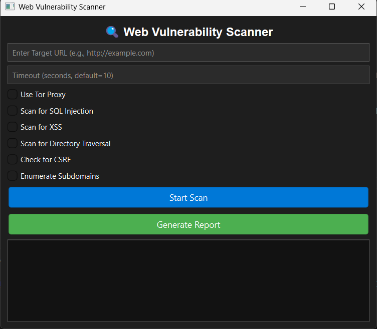

WEB\_VENERABILITY\_SCANNER
==========================

_Uncover Web Threats Before They Strike_

  

_Built with the tools and technologies:_


  


Overview
--------

Web\_Venerability\_Scanner is an advanced developer tool crafted to perform thorough security assessments of web applications. It integrates multiple vulnerability checks—such as SQL injection, XSS, directory traversal, CSRF, and subdomain enumeration—into a single, accessible platform.

**Why Web\_Venerability\_Scanner?**

This project aims to simplify and enhance web security testing. The core features include:

*   🛡️ **Multi-Vector Scanning:** Detects a wide range of common web vulnerabilities in one pass.
*   🎯 **Graphical Interface:** Provides an intuitive GUI for launching assessments and managing tests.
*   📄 **HTML Reports:** Generates detailed, easy-to-understand reports for security analysis.
*   🌐 **Anonymous Testing:** Supports scanning via Tor and proxies to maintain privacy.
*   🔧 **Modular Architecture:** Designed for easy integration and extension within larger security workflows.

* * *

## 🚀 Features
- ✅ **SQL Injection Detection**
- ✅ **XSS (Cross-Site Scripting) Detection**
- ✅ **Directory Traversal Scanner**
- ✅ **Subdomain Enumeration (crt.sh method)**
- ✅ **Tor & Proxy Support (Anonymous Scanning)**
- ✅ **HTML Report Generation**

## 🔧 Installation
### 1️⃣ **Clone the Repository**
```bash
https://github.com/Arya182-ui/Web_Venerability_Scanner.git
cd Web_Venerability_Scanner
```
### 2️⃣ **Install Dependencies**
```bash
pip install -r requirements.txt
```
### 3️⃣ **(Optional) Enable Tor for Anonymous Scanning**
Ensure that **Tor service** is running:
```bash
sudo service tor start
```

## 🛠 Usage
### 🔹 **Basic Scanning**
```bash
python scanner.py http://example.com
```
### 🔹 **Use Tor for Anonymous Scanning**
```bash
python scanner.py http://example.com --proxy
```
### 🔹 **Enable Subdomain Enumeration**
```bash
python scanner.py http://example.com --subdomains
```

## If you want use With GUI 

### 🔹**Use Gui_Scanner.py**

```bash
python Gui_Scanner.py
```

### 🔹Then paste link in inputbox and check for attacks check 


## 📄 Example Output
```
[+] Scanning for SQL Injection...
[+] Scanning for XSS...
[+] Checking for Directory Traversal...
[+] Enumerating subdomains...
[+] Report saved as report.html
```

## 📊 Report Generation
The scan results are saved in an **HTML report (report.html)** format.

## 🖥️ GUI Screenshots



## 🔥 Author
- **Ayush Gangwar**  
- GitHub: [Arya182-ui](https://github.com/Arya182-ui)  
- LinkedIn: [Ayush Gangwar](https://www.linkedin.com/in/ayush-gangwar-3b3526237)

## ☕ Support Me

Do you like My projects? You can show your support by buying me a coffee! Your contributions motivate me to keep improving and building more awesome projects. 💻❤  
[](http://buymeacoffee.com/Arya182)

---

## ⚠ Disclaimer
This tool is intended for educational purposes only. Use it **only on websites you own or have permission to test**. Unauthorized scanning may be illegal.

---
💡 **Suggestions & Contributions are Welcome!** 🚀
